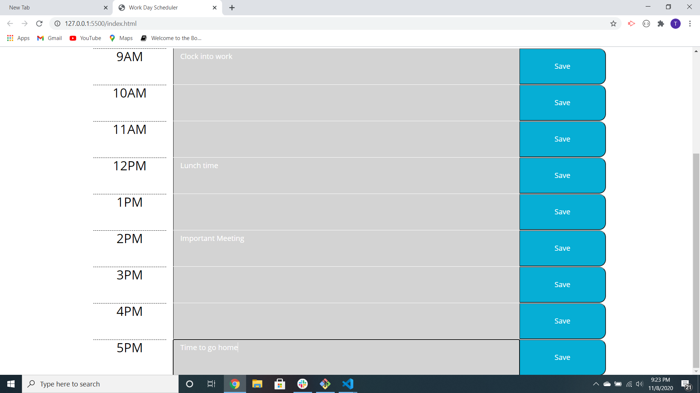

### Work-Day-Scheduler

### Motivation

* The motivation behind making this work day scheduler is to help people keep track of everything going on during their day. Some people have a very busy schedule during the day whether at work or not. This work day scheduler allows you to schedule everything that you need to do during the day hour by hour. Getting distracted during a typical day is almost an inevitability. You can use different means of keeping track of day to day activites such as a journal or calendar. The only problem with those methods is that if you forget them at home or at the office, you've already lost everything that you had written down until you find it again. The difference with this workday scheduler is that it can be accessed by mobile phone and no one ever forgets their phone.

### Features

* This application, in it's current build, allows you to save things that you need to do by the hour. It allows you to see what time it is and what time you're next event/meeting will be. This app shows your what time it currently is by highlighting the center box in red. It also shows what time already passed in gray and what time it will be soon in green.

### Build Status

* This build is close to being completely finished. Right now it is currently still a very good tool to show what time it is now and what time your next meetings/events will be. At the end of the build, server storage may be added to help you save information of your day to day activities across different platforms.

### Screenshots

*